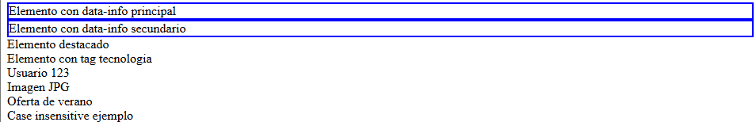

# Reto 2.3

Nombre y Apellidos: Pablo Rodríguez Crespo
URL del repositorio de gitlab: https://github.com/Pablosax9/ODAW2_RETO.2.3_selectores.git

## Ejercicio: Selectores de Atributos en CSS

Utilizando el HTML proporcionado, crea una hoja de estilos CSS para aplicar diferentes estilos a los elementos utilizando selectores de atributos. Debes realizar lo siguiente:

1. Seleccionar todos los elementos que tengan el atributo `data-info` y añadir un borde de 2 píxeles de color azul.

CSS:

    [data-info] {
        border: 2px solid blue;
    }

Resultado:



2. Seleccionar los elementos cuyo atributo `data-info` tenga el valor exacto `principal` y añadir un color de fondo amarillo claro.

CSS:

    [data-info="principal"] {
        background-color: lightyellow;
    }

Resultado:


3. Seleccionar los elementos cuyo atributo `class` contenga la palabra `destacado` y poner el texto en negrita.

CSS: 

    [class*="destacado"] {
        font-weight: bold;
    }

Resultado:


4. Seleccionar los elementos cuyo atributo `data-tags` contenga la palabra `tecnologia` y cambiar el color del texto a verde.

CSS:

    [data-tags~="tecnologia"] {
        color: green;
    }

Resultado:


5. Seleccionar los elementos cuyo atributo `data-nombre` comience con `user-` y convertir el texto a mayúsculas.

CSS:

    [data-nombre^="user-"] {
        text-transform: uppercase;
    }

Resultado:


6. Seleccionar los elementos cuyo atributo `data-url` termine con `.jpg` y añadir un borde de 3 píxeles de color rojo.

CSS:

    [data-url$=".jpg"] {
        border: 3px solid red;
    }

Resultado:


7. Seleccionar los elementos cuyo atributo `title` contenga la palabra `oferta` y añadir un color de fondo amarillo.

CSS:

    [title*="oferta"] {
        background-color: yellow;
    }

Resultado:


8. Seleccionar los elementos cuyo atributo `data-case` tenga el valor `ejemplo` sin distinguir entre mayúsculas y minúsculas y poner el texto en cursiva.

CSS:

    [data-case="ejemplo" i] {
        font-style: italic;
    }

Resultado:


Realiza estos cambios creando una hoja de estilos CSS externa llamada `styles.css` y enlázala al HTML proporcionado.

CSS CON TODOS LOS CAMBIOS:

    [data-info] {
        border: 2px solid blue;
    }

    [data-info="principal"] {
        background-color: lightyellow;
    }

    [class*="destacado"] {
        font-weight: bold;
    }

    [data-tags~="tecnologia"] {
        color: green;
    }

    [data-nombre^="user-"] {
        text-transform: uppercase;
    }

    [data-url$=".jpg"] {
        border: 3px solid red;
    }

    [title*="oferta"] {
        background-color: yellow;
    }

    [data-case="ejemplo" i] {
        font-style: italic;
    }

Resultado:


## HTML sugerido para probar los estilos

```html
<!DOCTYPE html>
<html lang="es">
<head>
    <meta charset="UTF-8">
    <meta name="viewport" content="width=device-width, initial-scale=1.0">
    <title>Ejercicio Selectores de Atributos</title>
    <link rel="stylesheet" href="styles.css">
</head>
<body>
    <div data-info="principal">Elemento con data-info principal</div>
    <div data-info="secundario">Elemento con data-info secundario</div>
    <div class="destacado">Elemento destacado</div>
    <div data-tags="tecnologia software">Elemento con tag tecnologia</div>
    <div data-nombre="user-123">Usuario 123</div>
    <div data-url="imagen.jpg">Imagen JPG</div>
    <div title="Gran oferta de verano">Oferta de verano</div>
    <div data-case="Ejemplo">Case insensitive ejemplo</div>
</body>
</html>
